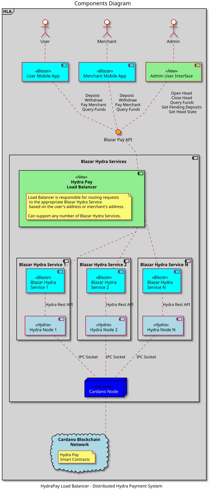
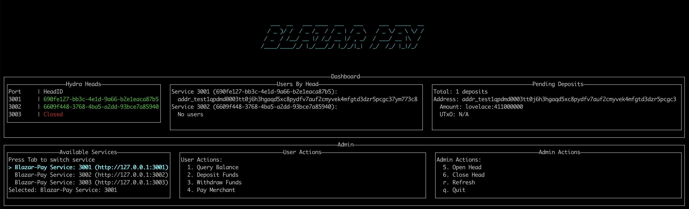

# HydraPay Load Balancer - Task Brief

## Executive Summary

The **HydraPay Load Balancer** is a horizontal scaling solution for the [Blazar Hydra](https://github.com/blazarlabs-io/blazar-hydra)  payment system, enabling multiple Hydra service instances to operate behind a single entry point. Built in Haskell using the Servant web framework, it provides intelligent request routing, service discovery, and result aggregation to create a seamless payment experience across distributed Hydra heads.

---

## What is HydraPay Load Balancer?

### Purpose

The HydraPay Load Balancer is a middleware server that sits between client applications (mobile apps, web interfaces) and multiple Blazar Hydra service instances. It enables horizontal scaling of the Hydra payment infrastructure by:

- **Service Discovery**: Automatically discovers available Blazar Hydra service instances by scanning configured port ranges
- **Unifying Access**: Presenting a single API endpoint while managing multiple Hydra heads
- **Request Distribution**: Routes user requests to appropriate service instances based on operation type
- **Result Aggregation**: Combines results from multiple services when querying user funds across the system


### Context: Blazar Hydra

The load balancer extends the [Blazar Hydra](https://github.com/blazarlabs-io/blazar-hydra) protocol, which enables fast and cheap Cardano payments through Hydra heads. The underlying system allows users to:

1. **Deposit** funds from L1 (Cardano mainnet) into a Hydra head (L2)
2. **Make Payments** to merchants within the Hydra head (fast, cheap transactions)
3. **Withdraw** funds back to L1 when needed

Each Blazar Hydra service instance manages its own Hydra head and connects to a shared Cardano node. The load balancer enables multiple such instances to operate simultaneously, increasing system capacity and fault tolerance.

---  

     
## How It Works

### Architecture Overview



### Core Components

#### 1. Service Discovery (`HydraPay.ServiceScanner`)

**How it works:**
- Scans a configurable port range (default: 3000-3019) for available services
- Makes HTTP GET requests to `/state?id=test-availability-check` on each port
- Treats any HTTP response (even 400/404) as "service available"
- Filters out connection errors/timeouts
- Updates service list every 30 seconds in a background thread

**Key Features:**
- Lightweight: No service registration or coordination required
- Automatic: Services are discovered without manual configuration
- Resilient: Handles services going up/down dynamically
- Thread-safe: Uses STM (Software Transactional Memory) for concurrent access

#### 2. Request Routing Strategies

The load balancer implements different routing strategies based on operation type:

| Operation | Strategy | Rationale |
|-----------|----------|-----------|
| `query-funds` | **Aggregate All** | Users need to see their total funds across all Hydra heads |
| `deposit` | **First Available** | Deposits are typically routed to a single head; first service handles it |
| `withdraw` | **First Available** | Withdrawals are specific to a head; first service handles it |
| `pay-merchant` | **Try All, Return First Success** | UTxO references are unique per Hydra Head; only one service will have the UTxO and succeed |

**Why "Try All" for Pay Merchant?**

The `pay-merchant` request includes the output reference (`fundsUtxoRef`) of the user's funds UTxO within the Hydra Head. This UTxO reference is **guaranteed to be unique** and exists in exactly one Hydra Head managed by one service instance.

When the load balancer forwards the request to all services:
- **One service** will successfully process the payment because it manages the Hydra Head containing that specific UTxO
- **Other services** will fail (typically with an error indicating the UTxO doesn't exist in their head)
- The load balancer returns the first successful response, which is guaranteed to be from the correct service

This approach eliminates the need for the load balancer to know which service manages which Hydra Head. Instead, it relies on the uniqueness of UTxO references to automatically route to the correct service.

#### 3. Result Aggregation (`query-funds`)

For `query-funds`, the load balancer:
- Sends queries to all discovered services in parallel
- Aggregates L2 (Hydra head) funds from all services:
  - Combines all `fundsInL2` UTxO references
  - Sums numeric values in `totalInL2` JSON objects (e.g., `{"lovelace": 1000}` + `{"lovelace": 500}` = `{"lovelace": 1500}`)
- Keeps L1 (Cardano mainnet) values from the first successful response (they represent the same on-chain state)
- Returns empty results if no services are available or all queries fail

#### 4. Error Handling

The load balancer implements graceful error handling:
- **Service Unavailable**: Returns empty results or 503 errors, but continues operating
- **Partial Failures**: For `query-funds`, ignores failed services and aggregates successful ones
- **Complete Failures**: For `pay-merchant`, aggregates all error messages for debugging
- **Error Propagation**: Forwards detailed error messages from services to clients

### API Endpoints

The load balancer exposes four user-facing endpoints:

1. **`GET /query-funds?address=<address>`**
   - Queries funds across all services and aggregates results
   - Returns combined L1 and L2 balances

2. **`POST /deposit`**
   - Forwards deposit requests to the first available service
   - Returns transaction CBOR for user to sign and submit

3. **`POST /withdraw`**
   - Forwards withdraw requests to the first available service
   - Returns transaction CBOR for user to sign and submit

4. **`POST /pay-merchant`**
   - Tries all services and returns the first successful response
   - Automatically routes to the correct service based on UTxO reference

---

## Development Challenges


### 1. Result Aggregation Logic

**Challenge:** Aggregating `query-funds` results from multiple services required:
- Combining UTxO reference lists
- Summing numeric values in nested JSON objects
- Handling different response structures
- Preserving L1 values from a single source (since they're the same across all services)

**Impact:** Users needed to see their total balance across all Hydra heads, but each service only knew about its own head.

**Solution:** Implemented recursive JSON aggregation:
- Created `aggregateJsonObjects` function that recursively merges JSON objects
- Adds numeric values with matching keys
- Recursively aggregates nested objects
- Concatenates UTxO reference vectors
- Keeps L1 values from first response (they represent the same on-chain state)

**Code Location:** `app/Server.hs` 

**Key Insight:** The aggregation needed to be type-safe while handling arbitrary JSON structures. Using Aeson's `Value` type allowed flexible handling of nested objects without knowing the exact structure ahead of time.

---

### 2. UTxO-Based Service Routing

**Challenge:** For `pay-merchant` requests, the load balancer needed to route to the correct service without maintaining a mapping of which service manages which Hydra Head.

**Impact:** Without knowing the service-to-head mapping, traditional routing strategies (round-robin, least-connections) wouldn't work.

**Solution:** Implemented "try all, return first success" strategy:
- Send payment request to all services in parallel
- Each service checks if it manages the Hydra Head containing the specified UTxO
- Only one service succeeds (the one with the UTxO)
- Return the first successful response
- Aggregate errors if all fail

**Code Location:** `app/Server.hs` 

**Key Insight:** UTxO references are globally unique within the Cardano ecosystem, so each UTxO exists in exactly one Hydra Head. This property allows automatic routing without maintaining state.

---

### 3. Service Discovery Without Registration

**Challenge:** Services don't register themselves with the load balancer. The load balancer needs to discover them automatically.

**Impact:** Required a scanning mechanism that:
- Doesn't overwhelm the network
- Handles services going up/down
- Works without coordination
- Updates dynamically

**Solution:** Implemented port scanning with health checks:
- Scan configurable port range sequentially with delays
- Make lightweight HTTP requests to test availability
- Accept any HTTP response (even errors) as "service available"
- Filter out connection errors/timeouts
- Update service list periodically in background thread
- Use STM for thread-safe concurrent access

**Code Location:** `src/HydraPay/ServiceScanner.hs`, `app/Server.hs` 

**Key Insight:** The approach prioritizes simplicity and zero configuration over sophisticated service registration. The trade-off is that services must be in a known port range, but this is acceptable for the use case.

---


### 4. Error Handling Across Multiple Services

**Challenge:** When querying multiple services, some may fail while others succeed. Need to handle partial failures gracefully.

**Impact:** 
- Users shouldn't see errors if at least one service succeeds
- Need to distinguish between "no services available" and "some services failed"
- Error messages should be helpful for debugging

**Solution:** Implemented multi-level error handling:
- For `query-funds`: Ignore individual service failures, aggregate successful results
- For `pay-merchant`: Try all services, return first success, aggregate errors if all fail
- For `deposit`/`withdraw`: Return 503 if no services, 502 with error details if service fails
- Format errors with debug information (request body, headers) for troubleshooting

**Code Location:** `app/Server.hs`, `src/HydraPay/Client.hs` 
**Key Insight:** Different operations require different error handling strategies. Query operations can tolerate partial failures, while write operations need clear success/failure signals.

---

### 9. Type Safety with Dynamic JSON Structures

**Challenge:** The API returns dynamic JSON structures (especially for `totalInL1` and `totalInL2`) that can contain arbitrary asset types and nested structures.

**Impact:** 
- Can't use strongly-typed Haskell records for all response fields
- Need to handle JSON values generically while maintaining type safety where possible

**Solution:** Used Aeson's `Value` type for dynamic fields:
- Strongly-typed records for known structures (UTxO references, transaction CBOR)
- Generic `Value` type for dynamic JSON objects (totals, amounts)
- Custom aggregation logic that works with `Value` type
- Type-safe parsing where structure is known

**Code Location:** `src/HydraPay/API/Types.hs` 

**Key Insight:** Cardano's multi-asset system means the API can return arbitrary asset types. Using `Value` for totals allows handling any asset without code changes, while maintaining type safety for known structures.

---

## Technical Stack

- **Language**: Haskell (GHC 9.6.6)
- **Web Framework**: Servant (type-safe API definitions)
- **HTTP Client**: http-client with TLS support
- **Concurrency**: STM (Software Transactional Memory) for thread-safe state
- **Database**: SQLite (via Persistent) for tracking committed deposits
- **Build System**: Cabal
- **Testing**: Integration tests with Servant client

---

## Testing the Load Balancer

### Prerequisites

Before testing the load balancer, ensure you have:

- **Docker** and **Docker Compose** installed
- **GHC** 9.6.6 or compatible
- **Cabal** 3.0 or later
- **cardano-cli** (optional, for checking node sync status)
- **curl** or **Bruno** (for API testing)

### Step 1: Start the Docker Compose Environment

Navigate to the `hydra-setup` directory and start the Docker Compose services:

```bash
cd hydra-setup
docker compose up -d
```

This will start:
- **Cardano Node** (Preprod testnet) - syncs with the Preprod network
- **3 Hydra Nodes** (alice, bob, charlie) - running on ports 4001, 4002, 4003
- **3 Blazar Hydra Services** - running on ports 3000, 3002, 3003

### Step 2: Wait for Cardano Node to Sync

**⚠️ Important:** The Cardano node needs to fully sync with the Preprod testnet before the Hydra services can function properly. This typically takes a few minutes.

Check the sync status using `cardano-cli`:

```bash
# Check node sync status
cardano-cli query tip --testnet-magic 1 \
  --socket-path=./cardano-node/node.socket
```

Look for the `syncProgress` field in the output. Wait until it reaches **100%** before proceeding.

Alternatively, monitor the Docker logs:

```bash
docker compose logs -f cardano-node
```

You should see messages indicating the node is syncing blocks. Wait until synchronization is complete.

**Why this matters:** The Hydra services depend on a fully synced Cardano node to:
- Query the current chain state
- Build valid transactions
- Verify UTxO references
- Submit transactions to the network

### Step 3: Verify Blazar Hydra Services are Running

Once the Cardano node is synced, verify that the Blazar Hydra services are running and accessible:

```bash
# Check service 1 (port 3000)
curl http://127.0.0.1:3000/state?id=test-availability-check

# Check service 2 (port 3002)
curl http://127.0.0.1:3002/state?id=test-availability-check

# Check service 3 (port 3003)
curl http://127.0.0.1:3003/state?id=test-availability-check
```

Each service should return a response (even if it's an error response, that indicates the service is running).

### Step 4: Build the Load Balancer

From the project root directory, build the load balancer server:

```bash
# Build the server executable
cabal build server
```

### Step 5: Run the Load Balancer

Start the load balancer server:

```bash
cabal run server
```

The server will:
1. Start on port **8080** (default)
2. Scan ports 3000-3019 for available services
3. Discover the running Blazar Hydra services
4. Begin serving requests
5. Refresh the service list every 30 seconds

You should see output like:

```
Scanning ports 3000-3019 for available services...
Found 3 available service(s):
  - Blazar-Pay Service: 3000 (http://127.0.0.1:3000)
  - Blazar-Pay Service: 3002 (http://127.0.0.1:3002)
  - Blazar-Pay Service: 3003 (http://127.0.0.1:3003)
Starting Hydra Pay Server on port 8080
Service list will be updated every 30 seconds
```

### Step 6: Access the API

The load balancer exposes its API on `http://127.0.0.1:8080`. Here are example API calls:

#### Query Funds (GET)

Query funds for an address across all services:

```bash
curl "http://127.0.0.1:8080/query-funds?address=addr_test1qpdmd0003tt0j6h3hgaqd5xc8pydfv7auf2cmyvek4mfgtd3dzr5pcgc37ym773c8w6q5uem08ts6qskrvc6mw6nvf4s3ah3ll"
```

**Response:** Aggregated funds from all available services:
```json
{
  "fundsInL1": [...],
  "fundsInL2": [...],
  "totalInL1": {"lovelace": 1000000},
  "totalInL2": {"lovelace": 500000}
}
```

#### Deposit (POST)

Create a deposit transaction:

```bash
curl -X POST http://127.0.0.1:8080/deposit \
  -H "Content-Type: application/json" \
  -d '{
    "user_address": "addr_test1qpdmd0003tt0j6h3hgaqd5xc8pydfv7auf2cmyvek4mfgtd3dzr5pcgc37ym773c8w6q5uem08ts6qskrvc6mw6nvf4s3ah3ll",
    "amount": [["lovelace", 100000000]]
  }'
```

**Response:** Transaction CBOR to sign and submit:
```json
{
  "cborHex": "84a3008182...",
  "fundsUtxoRef": {
    "txHash": "...",
    "outputIndex": 0
  }
}
```

#### Withdraw (POST)

Create a withdrawal transaction:

```bash
curl -X POST http://127.0.0.1:8080/withdraw \
  -H "Content-Type: application/json" \
  -d '{
    "address": "addr_test1qpdmd0003tt0j6h3hgaqd5xc8pydfv7auf2cmyvek4mfgtd3dzr5pcgc37ym773c8w6q5uem08ts6qskrvc6mw6nvf4s3ah3ll",
    "owner": "user",
    "funds_utxos": [{
      "signature": "...",
      "ref": {
        "txHash": "...",
        "outputIndex": 0
      }
    }],
    "network_layer": "L1"
  }'
```

#### Pay Merchant (POST)

Make a payment to a merchant:

```bash
curl -X POST http://127.0.0.1:8080/pay-merchant \
  -H "Content-Type: application/json" \
  -d '{
    "merchant_address": "addr_test1qpdmd0003tt0j6h3hgaqd5xc8pydfv7auf2cmyvek4mfgtd3dzr5pcgc37ym773c8w6q5uem08ts6qskrvc6mw6nvf4s3ah3ll",
    "funds_utxo_ref": {
      "txHash": "...",
      "outputIndex": 0
    },
    "amount": [["lovelace", 500000]],
    "signature": "..."
  }'
```

### Testing with Bruno

The project includes Bruno API collection files in `hydra-setup/Hydrapay/` that can be used to test the API. Update the `baseUrl` variable in Bruno to point to `http://127.0.0.1:8080` to test through the load balancer.

### Verifying Load Balancing Behavior

To verify the load balancer is working correctly:

1. **Query Funds Aggregation**: Query funds for an address that has deposits in multiple services. The response should aggregate balances from all services.

2. **Service Discovery**: Stop one of the Blazar Hydra services and verify the load balancer detects it within 30 seconds:
   ```bash
   docker compose stop blazar-hydra-2
   ```
   Check the load balancer logs - it should update the service list.

3. **Pay Merchant Routing**: The `pay-merchant` endpoint automatically routes to the correct service based on the UTxO reference. Try paying with a UTxO from a specific service and verify it succeeds.

### Troubleshooting

**Issue: No services found**
- Ensure Docker Compose services are running: `docker compose ps`
- Verify Cardano node is synced: Check sync status
- Check service logs: `docker compose logs blazar-hydra`

**Issue: 503 Service Unavailable**
- Verify services are accessible: `curl http://127.0.0.1:3000/state?id=test`
- Check load balancer logs for service discovery errors
- Ensure services are in the expected port range (3000-3019)

**Issue: Connection refused**
- Verify the load balancer is running: `cabal run server`
- Check if port 8080 is already in use: `lsof -i :8080`
- Ensure firewall isn't blocking the port

---

## Terminal User Interface (TUI)

The HydraPay Load Balancer includes a comprehensive Terminal User Interface (TUI) built with the [Brick](https://github.com/jtdaugherty/brick) library. The TUI provides an interactive, keyboard-driven interface for managing Hydra services and performing operations without needing to use curl or API clients.



### Overview

The TUI is a separate executable (`tui`) that provides:
- **Visual Dashboard**: Real-time status of all Hydra heads and services
- **Interactive Forms**: User-friendly forms for all API operations
- **Service Management**: Switch between multiple Blazar Hydra service instances
- **Database Integration**: Tracks committed deposits and displays users by head
- **Result Viewing**: Scrollable result screens with formatted output

### Starting the TUI

Build and run the TUI executable:

```bash
# Build the TUI
cabal build tui

# Run the TUI
cabal run tui
```

On startup, the TUI will:
1. Prompt for a starting port (default: 3000)
2. Prompt for a port range (default: 20 ports)
3. Scan the specified port range for available Blazar Hydra services
4. Display a splash screen with the Blazar Labs logo
5. Enter the main menu

### Main Menu Layout


The main menu is divided into three zones:

#### 1. Dashboard Zone (Top)

The dashboard displays real-time information across three widgets:

**Hydra Heads Table**
- Shows the status of all discovered services
- Displays service port and Head ID (or "Closed" if no head is open)
- Color-coded: Green for open heads, Yellow for opening, Red for closed

**Users By Head Widget**
- Lists all user addresses (from committed deposits) for each open head
- Organized by service port and Head ID
- Automatically updates when heads are opened/closed

**Pending Deposits Widget**
- Shows uncommitted deposits from the currently selected service
- Displays address, amount, and UTxO reference for each pending deposit
- Updates when switching services or refreshing

#### 2. Admin Zone (Bottom)

**Services Panel (Left)**
- Lists all available Blazar Hydra services
- Highlights the currently selected service with `>` indicator
- Shows service name and base URL
- Press **Tab** to cycle through services

**Actions Panel (Right)**
- **User Actions Menu**: Query Balance, Deposit, Withdraw, Pay Merchant
- **Admin Actions Menu**: Open Head, Close Head, Refresh, Quit

### User Actions

#### 1. Query Balance (`1`)
- Prompts for a Cardano address
- Queries funds from the currently selected service
- Displays L1 and L2 balances, UTxO references, and totals
- Results are scrollable with arrow keys

#### 2. Deposit Funds (`2`)
- Multi-field form:
  - User Address (required)
  - Public Key (optional)
  - Asset Unit (required, e.g., "lovelace")
  - Amount (required)
- Press **Tab** to move between fields
- Press **Enter** to submit
- Returns transaction CBOR for signing

#### 3. Withdraw Funds (`3`)
- Multi-field form:
  - Address (required)
  - Owner (required: "user" or "merchant")
  - UTxO Hash (required)
  - UTxO Index (required)
  - Signature (required)
- Press **Tab** to move between fields
- Press **Enter** to submit
- Returns transaction CBOR for signing

#### 4. Pay Merchant (`4`)
- Multi-field form:
  - Merchant Address (required)
  - UTxO Hash (required)
  - UTxO Index (required)
  - Asset Unit (required)
  - Amount (required)
  - Signature (required)
  - Merchant UTxO Hash (optional)
  - Merchant UTxO Index (optional)
- Press **Tab** to move between fields
- Press **Enter** to submit
- Returns transaction CBOR for signing

### Admin Actions

#### 5. Open Head (`5`)
- Prompts for Peer API URLs (space-separated)
- Pre-fills with the default peer URL based on selected service
- Opens a Hydra head for the currently selected service
- Automatically persists uncommitted deposits to the database
- Refreshes dashboard after opening

**Note**: The TUI prevents opening a head if one is already open for the selected service.

#### 6. Close Head (`6`)
- Shows the Head ID for the currently selected service
- Press **Enter** to close the head
- Automatically deletes deposits from the database for that service port
- Refreshes dashboard after closing

**Note**: The TUI prevents closing a head if none is open for the selected service.

#### Refresh (`r`)
- Refreshes all dashboard data:
  - Hydra Heads status
  - Users By Head
  - Pending Deposits
- Persists any missing deposits for open heads
- Useful for monitoring system state

#### Quit (`q` or `Esc`)
- Exits the TUI application

### Navigation and Controls

**Keyboard Shortcuts:**
- **1-6**: Select menu options
- **Tab**: Switch between services (main menu) or move between form fields
- **Enter**: Execute action or submit form
- **Esc**: Go back to main menu or quit
- **↑↓**: Scroll in result screens and viewports
- **PgUp/PgDn**: Page up/down in result screens
- **Home/End**: Jump to top/bottom of result screens
- **u/d**: Scroll Users By Head widget (up/down)
- **p/n**: Scroll Pending Deposits widget (previous/next)
- **a/s**: Scroll Admin Actions menu (up/down)

### Features and Benefits

**Use Cases:**
- **Development**: Quick testing and debugging of Hydra operations
- **Administration**: Managing multiple Hydra heads and services
- **Monitoring**: Real-time view of system state and pending deposits
- **Operations**: Performing deposits, withdrawals, and payments interactively

### Technical Details

**Architecture:**
- Built with Brick (terminal UI library for Haskell)
- Makes HTTP requests using the same client library as the load balancer


**Code Location:** `app/TUI.hs`, `app/Main.hs`

---

## Current Limitations

1. **Single Head Per Day**: The underlying Blazar Hydra design opens one head per day. The load balancer helps distribute load but doesn't change this fundamental limitation.

2. **Fixed Port Range**: Service discovery scans a fixed port range (e.g. 3000-3019). Dynamic service registration would improve scalability.

3. **No Load Metrics**: Doesn't consider service load or response times when routing requests. All routing is based on availability and operation type.

4. **No Admin API**: Admin endpoints (open-head, close-head) are not exposed through the load balancer. They must be called directly on service instances.

5. **Configuration**: Service discovery parameters are hardcoded. A configuration file or environment variables would improve deployment flexibility.

---

## Future Enhancements

7. **Circuit Breakers**: Implement circuit breakers to prevent cascading failures
8. **Request Caching**: Cache query-funds results for frequently accessed addresses


---

## Conclusion

The HydraPay Load Balancer represents a significant advancement in scaling Cardano payment infrastructure, successfully extending the Blazar Hydra payment system to support horizontal scaling through intelligent middleware design. This project demonstrates how careful architectural decisions and domain-specific routing strategies can overcome the inherent challenges of distributed payment systems.

### Key Achievements

The load balancer achieves its primary goal of enabling multiple Hydra service instances to operate seamlessly behind a single entry point, effectively transforming a single-service architecture into a horizontally scalable system. This is accomplished through three core innovations:

**1. Intelligent Operation-Based Routing**
The system implements distinct routing strategies tailored to each operation type, recognizing that different payment operations have fundamentally different requirements. The "try all, return first success" strategy for `pay-merchant` operations leverages the unique properties of UTxO references in the Cardano ecosystem, eliminating the need for complex service-to-head mapping while ensuring requests automatically route to the correct service. 

**2. Zero-Configuration Service Discovery**
The automatic service discovery mechanism eliminates the need for service registration, coordination protocols, or centralized service registries. By scanning a configurable port range and treating any HTTP response as an availability signal, the system achieves resilience and simplicity. This design choice prioritizes operational ease over sophisticated coordination mechanisms, making the system easier to deploy and maintain while still providing dynamic service detection.

**3. Sophisticated Result Aggregation**
The recursive JSON aggregation logic for `query-funds` operations demonstrates the complexity of combining results from multiple distributed systems. The solution handles arbitrary nested JSON structures, sums numeric values across different asset types, and correctly preserves L1 (mainnet) values while aggregating L2 (Hydra head) values. This capability enables users to see their complete balance across all Hydra heads without needing to query each service individually.


### Challenges Overcome

The development process encountered and solved several non-trivial challenges:

- **HTTP Protocol Nuances**: Handling HTTP header compatibility issues between different HTTP client libraries required deep understanding of the HTTP specification and careful testing
- **Dynamic JSON Structures**: Aggregating arbitrary JSON structures representing Cardano multi-asset values required recursive algorithms that maintain correctness while handling unknown asset types
- **Distributed State Management**: Coordinating operations across multiple services without shared state required innovative routing strategies that leverage domain-specific properties (UTxO uniqueness)
- **Error Handling Complexity**: Differentiating between acceptable partial failures and critical errors across multiple services required careful error classification and response strategies


### Future Potential

While the current implementation addresses the core requirements, the architecture provides a foundation for future enhancements. The modular design can accommodate circuit breakers, request caching, load-aware routing, and more sophisticated service discovery mechanisms. The TUI component demonstrates how the load balancer can serve as a platform for additional tooling and administrative interfaces.

### Final Thoughts

The HydraPay Load Balancer project demonstrates that effective scaling solutions require deep understanding of both the underlying system (Blazar Hydra, Cardano) and general distributed systems principles. 
The resulting system provides a robust, maintainable foundation for scaling Cardano payment infrastructure, enabling the HydraPay ecosystem to grow and handle increased load while maintaining the simplicity and reliability that users expect from payment systems.

